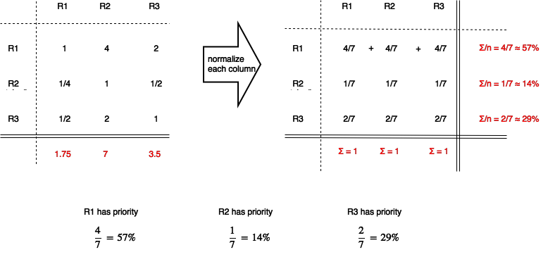

# **week02**
## PRIORITIZING REQUIREMENTS
- **ex**:
    - absolutely necessary: **critical**
    - highly desirable: **recommended**
    - possible: **suggested**

## ANALYTICAL HIERARCHICAL PROCESS
- more rigorous approach
- **key idea**: compare components / requirements parallels

#### EXAMPLE: [AHP](#analytical-hierarchical-process)
- 3 major requirements (R1, R2, R3)
- R1 is 4x as important as R2
- R1 is 2x as important as R3
- R3 is 2x as important as R2
- **Q**: *What is the overall importance of each?* [on MIDTERM]

## REQUIREMENT: DEFINITIONS, PROTOTYPING, REVIEWS
- customer involved? **YES**
- definition involves writing up the requirements
- if we need clarification, we can prototype
- prototypes are common for user interface
    - **low-fidelity**: papers/cards
    - **high-fidelity**: mockup in a browser / Visual Basic
- results go through a review

## REQUIREMENT SPECIFICATION
- customer involved? **NO**
- this is what customer will sign OFF on
- in some organizations
    - **requirement documentation [HI]**: written more for **customers**
    - **requirement specification [LO]**: written more for **technical folks**
    - some specification languages are even executable

## REQUIREMENT AGREEMENT
- customer involved? **YES**
- customer signs, marking end of requirement engineering

## ANALYSIS MODELS
- "formal model" is used to write up the results of analysis
- [SA]: **structured analysis** (1960s)
- [O-OA]: **unified modeling language** (1990s)
- how do [SA] and [O-OA] differ?
    - structured analysis considers data and operations separately whereas **o**bject-**o**riented **a**nalysis considers them together